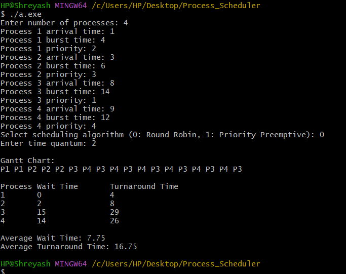

# Process Scheduler Simulation

## Overview
This project simulates CPU scheduling algorithms—Round Robin and Priority Scheduling (with preemption)—using C++ and POSIX threads. It is designed to reinforce operating system concepts by simulating concurrent process execution and kernel-level scheduling.

## Features
- Simulates concurrent process execution using threads
- Implements Round Robin and Priority Scheduling (preemptive)
- Preemption logic for realistic scheduling
- Gantt chart visualization (text-based)
- Calculates wait and turnaround times for each process
- Systems-level programming with synchronization

## Output Example
Below is a placeholder for the output screenshot. After running the program, you can add a screenshot of the Gantt chart and statistics here:



## Getting Started

### Prerequisites
- C++11 or later
- POSIX threads (pthreads)
- GCC (MinGW-w64 for Windows/MSYS2, or Linux/macOS)

### Build Instructions
Open your terminal in the project directory and run:

```sh
g++ -std=c++11 -pthread src/main.cpp src/scheduler.cpp -o a.exe
```

### Run Instructions
Execute the compiled program:

```sh
./scheduler.exe
```

Follow the prompts to enter process details and select the scheduling algorithm.

## Project Structure
- `src/main.cpp` — Main entry point
- `src/scheduler.h` — Scheduler and process definitions
- `src/scheduler.cpp` — Scheduler implementation
- `.github/copilot-instructions.md` — Copilot instructions
- `README.md` — Project documentation

## Contributing
Pull requests are welcome. For major changes, please open an issue first to discuss what you would like to change.

## License
This project is open source and available under the MIT License.
